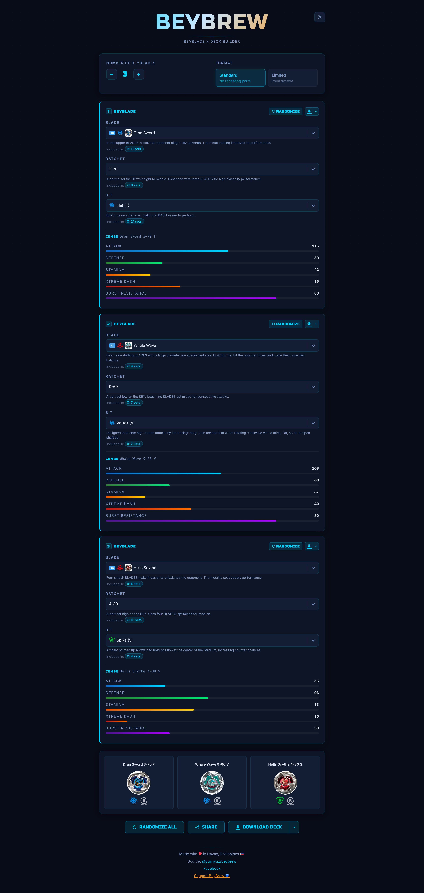
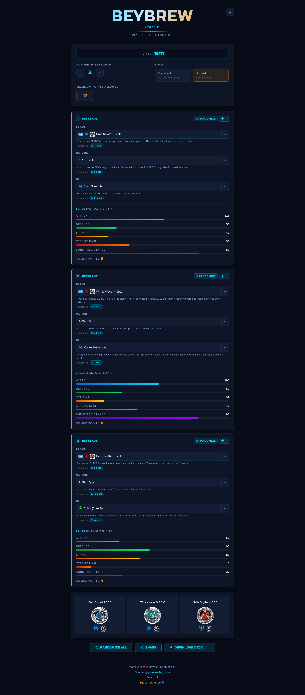

# BeyBrew

A client-side **Beyblade X** deck builder. Build and share combos, compare stats, and export your deck as a PNG.

**Live app:** https://beybladebrew.com

Android/data/jp.co.takaratomy.beyblade/files/MasterData.json

---

## Screenshots


*Build your deck by selecting blade, ratchet, and bit for each combo*


*Limited format — parts sorted by points, duplicates disabled, total tracked*

---

## Features

- **Standard & Limited formats** — Standard enforces no duplicate parts; Limited tracks total points per deck
- **CX line support** — CX blades unlock an extra Assist Blade + Lock Chip slot; thumbnails show blade + lock chip overlay
- **Over Blade (4-part CX)** — CX combos support an Over Blade slot; 4P badge in selector; stats and alias included in combo display
- **Mode-specific images** — Parts with multiple modes (e.g. Lightning L-Drago, Phoenix Wing) display the correct image per selected mode
- **Deck Profile Panel** — Shows archetype tag, blader name, and KPI donut circles for aggregated Attack, Defense, Stamina, and Burst Resistance
- **Line accent colors** — Lineup cards are highlighted with each blade's line color for quick identification
- **Stat bars** — Per-combo aggregated Attack, Defense, Stamina, and Burst Resistance; changing a part briefly flashes the delta for each affected stat
- **Dropdown stat comparison** — Hovering a part in the selector shows `STAT before→after` badges for every stat that changes, so you can compare without losing sight of the current values
- **Randomizer** — Randomize the full deck or individual combos
- **Share via URL** — Deck state is encoded and compressed in the URL; paste to share
- **Embed URLs** — Compressed embed links via LZString for lightweight sharing
- **PNG export** — Download individual combo cards or the full deck as a branded image
- **Turbo auto-sync** — Selecting Turbo (Ratchet Integrated Bit) syncs ratchet/bit automatically
- **PWA / Offline support** — Installable as a home screen app; works offline via service worker precaching

---

## Tech Stack

- [React 18](https://react.dev/) + [Vite](https://vitejs.dev/)
- [Tailwind CSS](https://tailwindcss.com/)
- [react-select](https://react-select.com/) for part dropdowns
- [modern-screenshot](https://github.com/qq15725/modern-screenshot) for PNG export

---

## Development

```bash
npm install
npm run dev        # Start dev server at localhost:5173
npm run build      # Production build → /dist
npm run lint       # ESLint check
npm run lint:fix   # Auto-fix ESLint violations
npm run deploy     # Build + deploy to GitHub Pages
```

---

## Adding Parts

1. Add the part entry to the appropriate array in `src/data/beyparts.json` — follow the existing object shape for that part type.
2. Place the part image in `public/images/`.
3. Run `npm run dev` to verify it appears correctly in the selector.

### How Images Are Loaded

The app uses a **two-tier lookup** (`src/lib/imageResolver.js`):

1. **Primary: postimg CDN** — `src/data/image-urls.json` maps every image filename to a `https://i.postimg.cc/...` URL. This is the first place the resolver checks.
2. **Fallback: local `public/images/`** — if the image isn't in the JSON map, it falls back to `/images/<filename>`.

> **Important:** Images downloaded to `public/images/` are **not automatically served** unless they are also registered in `image-urls.json`. To update the CDN map after adding new images, run `node scripts/update-image-urls.mjs` (requires `img_links.txt` with postimg links).
>
> **Best practice:** Upload new images to [postimg.cc](https://postimg.cc) and add the links to `img_links.txt`, then run the update script. This keeps the app fast and avoids bundling large image files in the repo.
